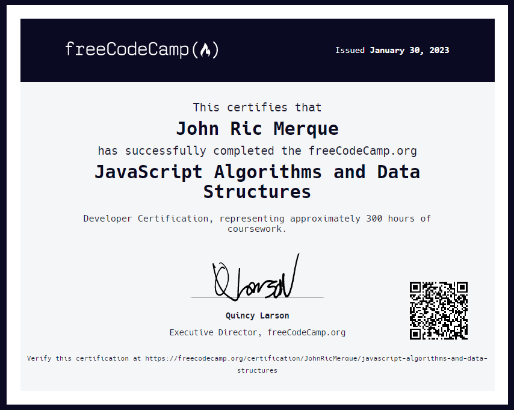

# frontend-webdev-exploration
Learning JavaScript Data Structures and Algorithms through a free online course by [freeCodeCamp](https://www.freecodecamp.org/learn/javascript-algorithms-and-data-structures/#basic-javascript).

# Certification

Link: https://www.freecodecamp.org/certification/JohnRicMerque/javascript-algorithms-and-data-structures
